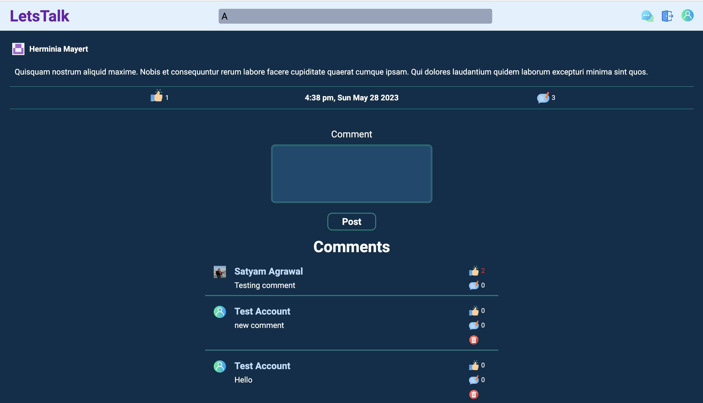
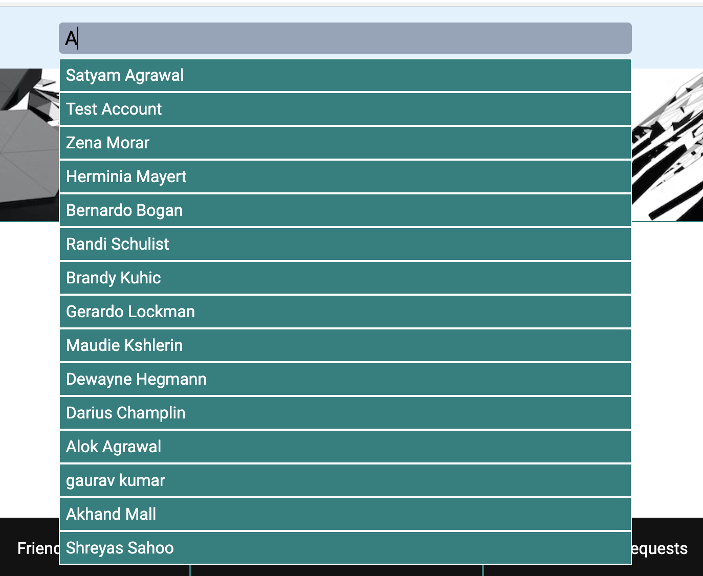

[Front-end Repository](https://github.com/Asatyam/SocialNetwork)
 [Back-end Repository](https://github.com/Asatyam/SocialNetworkAPI)
 

# Social Network - A social media app

Social Network is an app to share posts and make friends.
Some of the features of the website are:

- Implement sign up and login through PassportJS
- Use JWT for user authentication
- Users can create posts
- Users can add like posts and add comments to it.
- Users can like posts as well as comments.
- Users can add image to their posts
- Users can send and accept other users' friend requests.
- Home page shows all the posts shared by the user and their friends sorted by date.
- User's profile page shows all the posts and friends of the user
- User can update their profile, including adding and removing profile photos.
- User can see all the posts liked by them.
- Users can see all the recieved and sent friend requests.
- Home page also shows 10 new users to make new friends.
- Search for other users.

## TECH STACK
- MongoDB
- ExpressJS
- ReactJS
- NodeJS
- NextJS
- CSS3 
- HTML5

## Other important libraries
- PassportJS for authentication
- Mongoose as ORM for MongoDB
- Multer and Cloudinary for uploading images
- JWT for verifying user's identity
- axios for calling APIs from the front-end
- bcryptjs for hashing the password
- CORS
- dotenv for accessing environment variables 
- express-validator for verifying user inputs at the server side

## Screenshots

